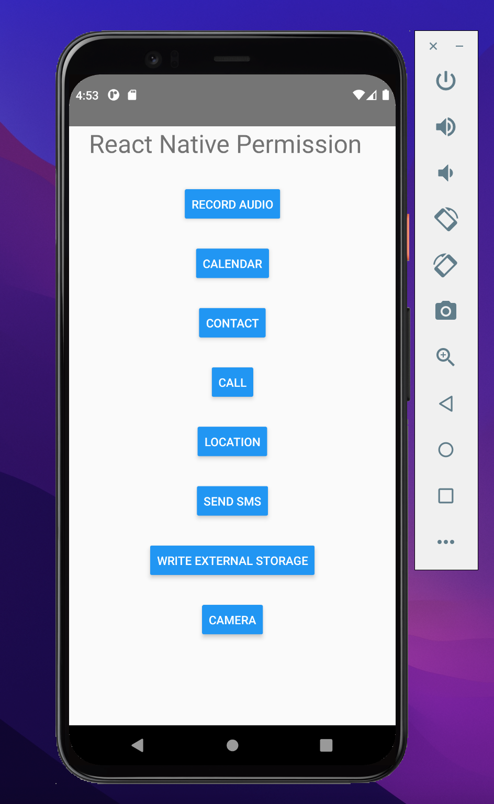
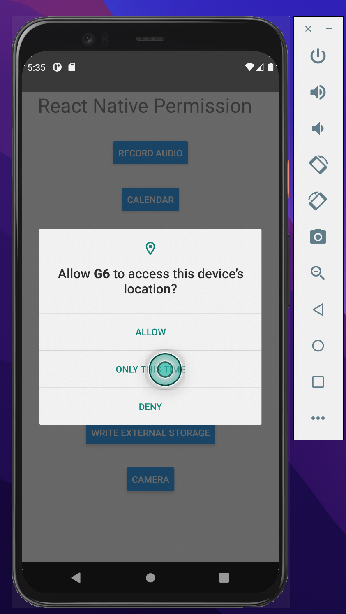

# React_Native_Permission
This repository is about basics of react-native permissions. 

## Screenshots

### Send SMS

  
  

### Camera

  
  

  
  
### Audio

  
  

  

### Photos

  
  

  
  
### Calendar

  
  

  
  
### Location

  
  

  
  ### Contacts

  
  

  
  
  
  ### Call

  
  

  
  
   ###  Updated Changes 

  
  

  

  
  

  

  
  

Created by Bhawna Verma.
